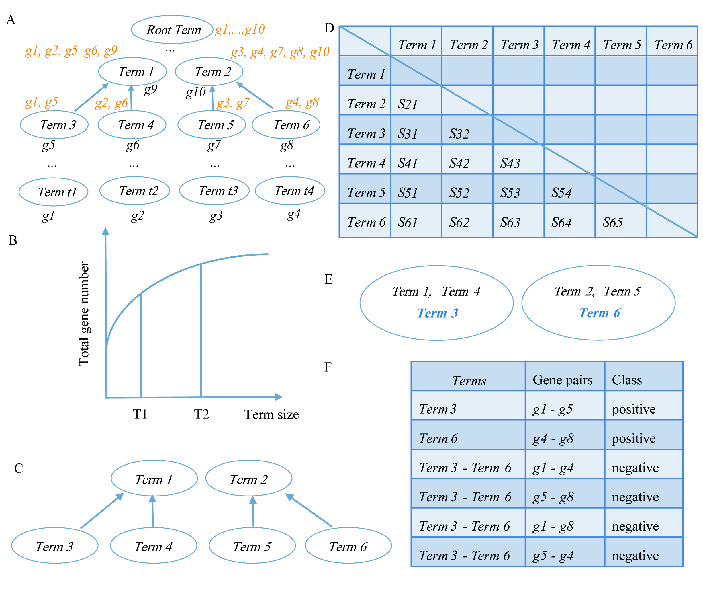

# GSminer
## Overview
GSminer, an R package that can automatically select gold standard including positive and negative genes pairs 
based on the Gene Ontology information of a specific species.
## The schematic flowchart of GSminer 


## Installation

``` r
# The easiest way to get GSminer is to install with devtools:
library(devtools)
devtools::install_github("ShadowFiendSF/GSminer")
```

## Getting started

``` r
library(GSminer)
```

There are two classes in the GSminer package: GeneGOMapping class and GSminer class. You can get the detailed information by:
``` r
?GeneGOMapping()
?GSminer()
```

## Usage

The GSminer package provides a very simple and friendly API.
GSminer needs a gene and GO term mapping file as the input(the default delimiter is tab).
``` r
# the example data in GSminer package
miner1 <- GSminer()
outputPosNeg(miner1, u = 0.5, l = 0.25, multicores = 3, verbose = TRUE, seed = 100, 
             posFilename = "positiveGene.txt", negFilename = "negativeGene.txt")
# for your data
miner2 <- GSminer(inputFile = "yourData", sep = "\t")
outputPosNeg(miner2, u = 0.5, l = 0.25, multicores = 3, verbose = TRUE, seed = 100, 
             posFilename = "positiveGene.txt", negFilename = "negativeGene.txt")
# the relationship between the GeneGOMapping class and GSminer class in the GSminer package
miner3 <- GSminer()
ggmap <- new("GeneGOMapping", inputFile = "inst/extdata/TAIR.GO", sep = "\t")
miner3@ggmapping <- ggmap
```

## Citation

Zefeng Wu, Zhaohong Li and Ruolin Yang: GSminer: An R package for generating gold standard applied in gene functional network predictions.2018
