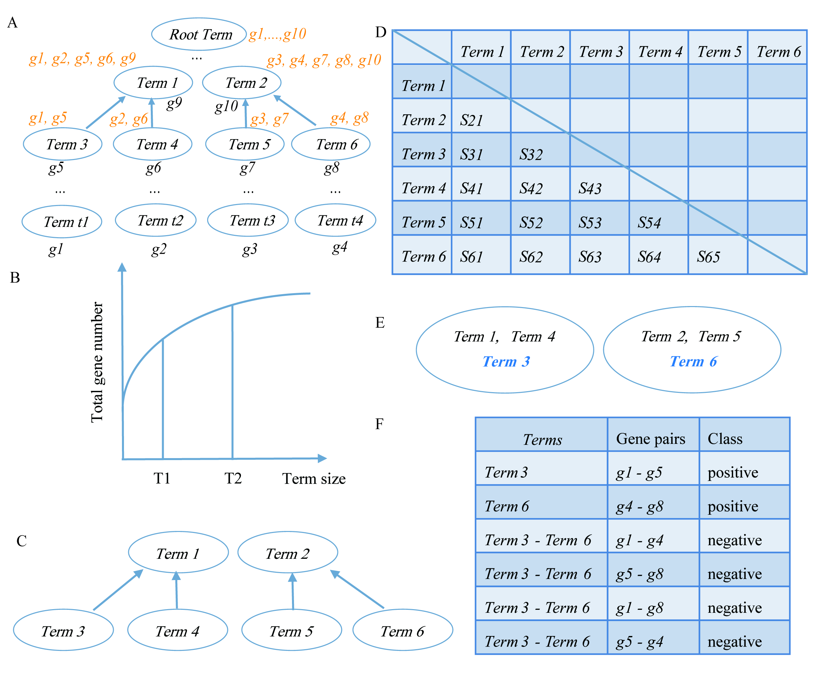

```{r setup, include=FALSE}
knitr::opts_chunk$set(tidy = FALSE,
                      warning = FALSE,
                      message = FALSE)
```

# Abstract

We developed an R package, GSminer, that can automatically generate a gold standard including positive and negative gene pairs given gene-GO term mapping information for a specific species.

# Introduction

One important task for systems biology is to identify the gene-gene interactions toward a better understanding of gene functions. With the great advances in producing various large-scale and high throughput data sets for more and more species in recent decades, it offers us an unprecedented opportunity to integrate these omics data to perform functional gene network inferences. However, a substantial challenge is to build a high-quality gold-standard reference set that is not always available and whose quality determines the performance of machine learning-based network inference. We developed an R package than can automatically select gold standard based on Gene Ontology information of a species.

# The schematic flowchart of GSminer 

The schematic flowchart of GSminer can be summarized in Figure 1.
```{r fig.cap="\\label{fig:figs}The schematic flowchart of GSminer", fig.align="center", fig.height=2, fig.width=2, out.width ='70%', out.height='70%', echo=FALSE, fig.show ='asis', out.extra = ''}

```

(A)The process of propagation of GO terms. Gene names in black represent the original annotations to GO terms; gene names in orange indicate the associated genes after the propagation. (B) The relationship between the threshold (term size) and the number of genes annotated to corresponding GO terms. (C) The resultant GO terms after the first two steps. (D) The sematic similarity among the selected GO terms. (E) The table indicates the resultant gold standard. After clustering by APCluster, only Term3 and Term6 are selected, which reduces the redundancy among GO terms. (F) The table showing the resultant gold standard.  

# Installation

```{r, eval = FALSE}
# The easiest way to get GSminer is to install with devtools:
library(devtools)
devtools::install_github("ShadowFiendSF/GSminer")
```

# Getting Start 

To use GSminer, just library GSminer:

```{r cars, echo = TRUE,  message = TRUE}
library(GSminer)
```


# Usage

The GSminer package provides a very simple and friendly API. GSminer needs a gene and GO term mapping file as the input(the default delimiter is tab).
```{r pressure, message = TRUE, echo = TRUE}
# the format of input file
inputFile <- paste0(system.file(package = "GSminer"), "/extdata/TAIR.GO")
mydata <- read.table(inputFile, header = FALSE, sep = "\t", stringsAsFactors = FALSE)
names(mydata) <- c("GeneID", "GOTerm")
head(mydata)

# the example data in GSminer package
miner1 <- GSminer()
outputPosNeg(miner1, u = 0.5, l = 0.25, multicores = 2, verbose = TRUE, seed = 100, 
             posFilename = "positiveGene.txt", negFilename = "negativeGene.txt")

#the relationship between the GeneGOMapping class and GSminer class in the GSminer package
miner3 <- GSminer()
ggmap <- new("GeneGOMapping", inputFile = "data/TAIR.GO", sep = "\t")
miner3@ggmapping <- ggmap
```
```{r, message = TRUE, echo = TRUE, eval=FALSE}
# for your data
miner2 <- GSminer(inputFile = "yourData", sep = "\t")
outputPosNeg(miner2, u = 0.5, l = 0.25, multicores = 3, verbose = TRUE, seed = 100, 
             posFilename = "positiveGene.txt", negFilename = "negativeGene.txt")

```

# Result

We compared the semantic similarity between the pairs of genes in the gold standard positive (GSP) and negative (GSN) genes pairs data sets(Figure 2). The semantic similarity between two genes was calculated according to Resnik’s method.
```{r fig.cap="\\label{fig:figs}Distribution of semantic similarities between pairs of genes in GSP or GSN.", fig.align="center", fig.height=2, fig.width=2, out.width ='70%',  out.height='70%', echo=FALSE, fig.show ='asis', out.extra = '', fig.pos='htb!'}

```
 
# The R and the packages version

```{r}
# the R and the packages version used
sessionInfo()
```

# Citation
If you use [GSminer] in published research, please cite:
Zefeng Wu, Zhaohong Li and Ruolin Yang: GSminer: An R package for generating gold standard applied in gene functional network inference.2018 (in submission)
